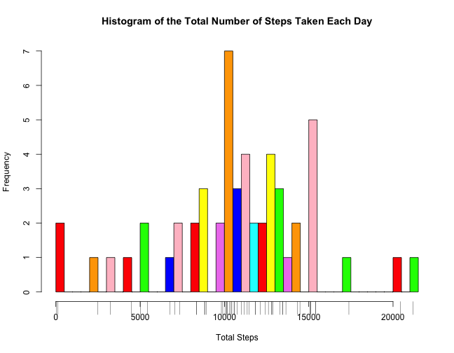
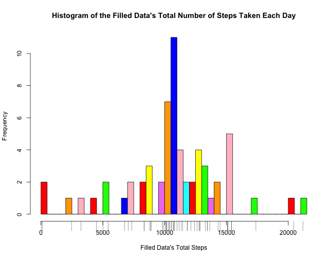
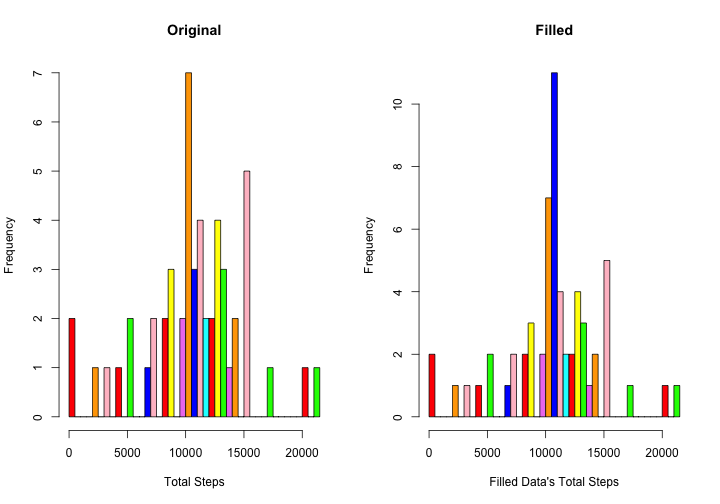
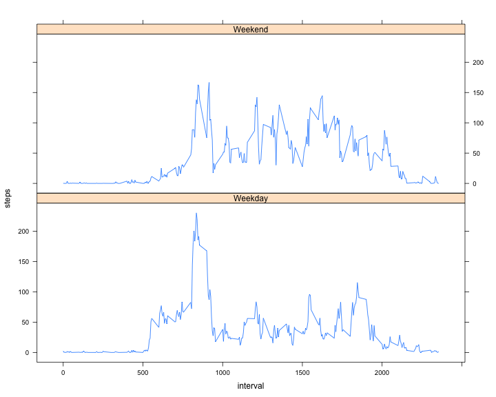

Peer Assessment 1 : An Analysis of Activity
========================================================

This report is to fufill the requiremnets set by Peer Assessment 1, which is part of JHU's course in [Reproducible Research](https://www.coursera.org/course/repdata), hosted on Coursera circa summer of 2014. In this document we take data from from a personal activity monitoring device and process it in order to answer the questions set by the assignment. The variables in the data set are as follows:


1. **steps** : Number of steps taking in a 5-minute interval (missing values are coded as NA).

2. **date** : The date on which the measurement was taken in YYYY-MM-DD format.

3. **interval** : Identifier for the 5-minute interval in which measurement was taken.


### Loading and preprocessing the data
First, I will load the data, fetching it from the internet, unzipping it, and the reading it into memory using **read.csv()**. Then I will change the date format to POSIXct.


```r
## 1) Fetch dataset, if not present, and unzip in the user's working directory

    myzip = "activity.zip"
    #if data file has not yet been downloaded, fetch it
    if (!file.exists(myzip)) {
        download.file("https://d396qusza40orc.cloudfront.net/repdata%2Fdata%2Factivity.zip", destfile=myzip, method="curl")
        unzip(myzip)
    }

## 2) Read in data set and convert the date column (variable) into POSIXct format

    activity <- read.csv("activity.csv", stringsAsFactors = FALSE)
    
    activity$date <- as.POSIXct(activity$date, format="%Y-%m-%d")
```

### What is mean total number of steps taken per day?
Now that the data has been loaded into memory, with dates formated in POSIXct, we can derive a new data frame that contains the total number of steps taken each day. Using this new data frame, we can then display the frequency in the  total number of steps taken each day in the form of a histogram.


```r
## 0) Find the total number of steps taken each day

    totalSteps <- aggregate(steps ~ date, data = activity,  FUN = sum)

## 1) Make a histogram of the total number of steps taken each day

colors = c("red", "yellow", "green", "violet", "orange", 
   "blue", "pink", "cyan")
   
hist(totalSteps$steps, col = colors, breaks=40,  main="Histogram of the Total Number of Steps Taken Each Day",  xlab="Total Steps")

rug(totalSteps$steps, ticksize = -.05)	
```

 

Next, we can calculate and report the **mean** and **median** total number of steps taken per day.


```r
## 2) Calculate and report the mean and median total number of steps taken per day

meanTotal <- mean(totalSteps$steps)


medianTotal <- median(totalSteps$steps)

print(as.data.frame(cbind(meanTotal, medianTotal), row.names = ""))
```

```
##  meanTotal medianTotal
##      10766       10765
```

### What is the average daily activity pattern?

Now, we make a time series plot of the 5-min interval and the mean number of steps, averaged across all days 


```r
## 1) Make a time series plot (i.e. type = "l") of the 5-min interval (x-axis),
##   and the avg number of steps, avg across all days (y-axis).


meanStepsInterval <- aggregate(steps ~ interval, data = activity,  FUN = mean, na.action = na.omit)
colnames(meanStepsInterval) <- c("interval", "meanSteps")


plot(meanStepsInterval$interval, meanStepsInterval$meanSteps, type = "l",  xlab= "Interval", ylab= "Average Number of Steps", main="Average Number of Steps per Interval")
```

 

Now, we find the precise peak activity via the following R code:


```r
## 2) Find the 5-min interval, on avg across all days in the dataset, that contains the max number of steps

as.data.frame(meanStepsInterval[meanStepsInterval[2] == max(meanStepsInterval[2]),], row.names="")
```

```
##  interval meanSteps
##       835     206.2
```


As we can see by the graph, as well as from our output, the maximum mean amount of activity for each day occurs around the 835th 5 minute interval, which should correspond to the time from 08:35:00 to 08:39:59.

### Input missing values

Unfortunately, our data set is littered with missing values. The following R code calculates a total of the number of NAs.


```r
## 1) Calculate and report total number of missing values (i.e. total rows with NA)

sum(is.na(activity[1]))
```

```
## [1] 2304
```


Next, in order to remove any bias that might occur in summarizing our activity data set, we can fill in missing values (NAs) using the mean value for that particular 5 minute interval during any given day.


```r
## 2) Devise a strategy for filling in all of the missing value

## I will use the mean value for that particular 5-min interval

## 3) Create a new dataset that is equal to the original, but with missing values replaced


filledActivity <- activity

for(i in 1:length(activity[,1])){
    
	if(is.na(activity[i,1])){
		filledActivity[i,1] <- meanStepsInterval[meanStepsInterval$interval == activity[i,3], 2]

	}
	
	
}
```

Now that we have a complete data set, let's plot a histogram of frequency in the total number of steps taken each day, and then repor the **mean** and **median** values for the total number of steps taken per day. First the histogram:


```r
## 4) Make a histogram of the total number of steps taken each day, calculate and report the mean and median 
##    total number of steps per day; compare these to those found in the first part. What is the impact of filling 
##    in the missing data on estimates of the total daily number of steps

filledTotalSteps <- aggregate(steps ~ date, data = filledActivity,  FUN = sum)


colors = c("red", "yellow", "green", "violet", "orange", 
   "blue", "pink", "cyan")
   
hist(filledTotalSteps$steps, col = colors, breaks=40,  main="Histogram of the Filled Data's Total Number of Steps Taken Each Day",  xlab="Filled Data's Total Steps")

rug(filledTotalSteps$steps, ticksize = -.05)
```

 

Now the **mean** and **median** values for the total number of steps taken per day :


```r
filledMeanTotal <- mean(filledTotalSteps$steps)


filledMedianTotal <- median(filledTotalSteps$steps)

print(as.data.frame(cbind(filledMeanTotal, filledMedianTotal), row.names = ""))
```

```
##  filledMeanTotal filledMedianTotal
##            10766             10766
```

Comparing the initial to our derived:


```r
par(mfrow = c(1,2))

hist(totalSteps$steps, col = colors, breaks=40,  main="Original",  xlab="Total Steps")

hist(filledTotalSteps$steps, col = colors, breaks=40,  main="Filled",  xlab="Filled Data's Total Steps")
```

 

```r
print(cbind(as.data.frame(cbind(meanTotal, medianTotal), row.names = ""), as.data.frame(cbind(filledMeanTotal, filledMedianTotal), row.names = "")))
```

```
##   meanTotal medianTotal filledMeanTotal filledMedianTotal
## 1     10766       10765           10766             10766
```
In comparing the two, one can see that the filled data has changed with regards to the frequency count; that is, it has more repeated values and thus a larger y-axis. Also, the filled data seems to better reflect a normal distribution, with its peak centered at the mean. Notice too that the mean and median are the same for the filled data set.

### Are there differences in activity patterns between weekdays and weekends?

Using our new complete data set, let's see if we can find any difference in activity on the Weekends versus the Weekdays. First we will create a new data frame,**tempActivity**, that has a variable which differentiates a given date in terms of Weekday or Weekend:


```r
## 1) Create a new variable in the dataset with  -"weekdays" and "weekends" - indicating if a date
##    is a weekday or a weekend

tempActivity <- filledActivity 


tempActivity[weekdays(tempActivity[,2]) == "Saturday" | weekdays(tempActivity[,2]) == "Sunday",4] <- "weekend"

tempActivity[!(weekdays(tempActivity[,2]) == "Saturday" | weekdays(tempActivity[,2]) == "Sunday"),4] <- "weekday"

colnames(tempActivity) <- c("steps", "date", "interval", "partOfWeek")
```

Next, we can find the average number of steps taken, during every interval, for both weekends and weekdays. Following that, we can plot both side by side for a proper comparison:


```r
library(reshape2)

library(lattice)


meanWeek<- aggregate(steps ~ partOfWeek + interval, data = tempActivity,  FUN = mean, na.action = na.omit)

meanWeekday <- meanWeek[meanWeek[,1] == "weekday", ]
 
meanWeekend <- meanWeek[meanWeek[,1] == "weekend", ]

 
combined <- cbind(meanWeekend[c(2,3)], meanWeekday[3]) 

colnames(combined) <- c("interval", "Weekend", "Weekday")

mm <- melt(subset(combined,select=c(interval, Weekday, Weekend)),id.var="interval") 

colnames(mm) <- c("interval", "variable", "steps")


xyplot(steps~interval|variable,data=mm,type="l",
       layout=c(1,2))
```

 

Judging from these two plots, activity, with respect to the number of steps taken, appears to be more distributed during the weekends; that is, the subject takes more steps throughout the course of the day. However, the intensity, mean number of steps, of any particular weekend interval is not nearly as high as the peak found in the 835th interval of the weekday. 

Perhaps, the data reflects an individual who, on weekdays, walks to work, or school during the morning and then takes part in activities that require very little movement; on the weekends, the subject appears to be moving more often, but not as intensly as during his normal weekday morning walk to work, or school.
